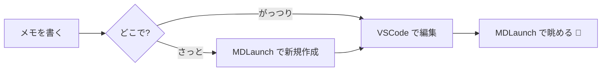

MDLaunch のビューワーが対応している記法の一覧です。このページ自体がテストを兼ねています。

## frontmatter

ファイル先頭に YAML で書きます。`title` / `icon`(絵文字) / `tags` が使えます。

```yaml
---
title: 記法ガイド
icon: ✍️
tags: [guide, memo]
---
```

## Wikiリンク

`[[ノート名]]` でノート同士をつなげます。表示名を変えるなら `[[ノート名|表示名]]`。

例: [[MDLaunch へようこそ|ようこそページ]] へ戻る。リンクされた側には自動でバックリンクが出ます。

同名のノートが別フォルダに複数あるときは、[[guide/記法ガイド|フォルダ名/ノート名]] のようにパスで指定します(パスは末尾の一部だけでOK)。名前だけで書いて候補が複数ある場合、リンクはオレンジ色の警告表示になります(先頭候補には飛べます)。

## コードブロック

```python
def hello(name: str) -> str:
    """Pygments でハイライトされます"""
    return f"Hello, {name}!"
```

## Mermaid 図表

````

````

と書くと、こうなります:


## 数式 (KaTeX)

インラインは `$...$`: オイラーの等式 $e^{i\pi} + 1 = 0$ は美しい。

ブロックは `$$...$$`:

$$
\int_{-\infty}^{\infty} e^{-x^2}\,dx = \sqrt{\pi}
$$

$$
\begin{pmatrix} a & b \\ c & d \end{pmatrix}
\begin{pmatrix} x \\ y \end{pmatrix}
=
\begin{pmatrix} ax + by \\ cx + dy \end{pmatrix}
$$

数字に隣接するドル記号(例: $5 と $10)は数式になりません。それ以外の場所でドル記号を文字として書きたいときは、直前にバックスラッシュを付けてエスケープします。

## テーブル・タスクリスト

| 機能 | 状態 |
|---|---|
| 検索 (Ctrl+K) | ✅ |
| タグフィルタ | ✅ |
| バックリンク | ✅ |

- [x] 記法ガイドを読む
- [ ] 自分のノートを作ってみる

## その他

> 引用、**太字**、*斜体*、`インラインコード`、~~打ち消し~~ も使えます。

---

区切り線も。
